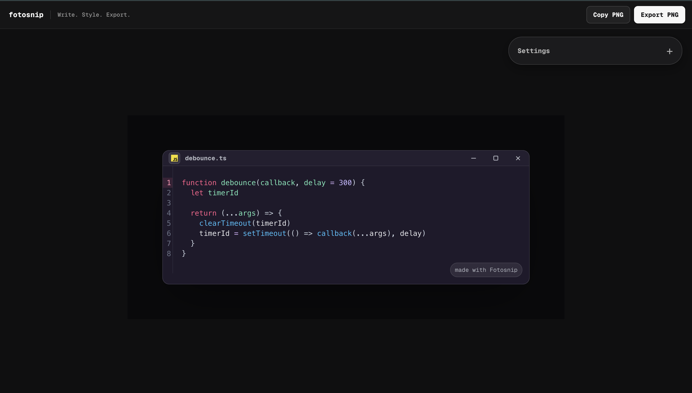

# Fotosnip

Write, style, and export beautiful code screenshots directly in your browser.



Fotosnip is a focused code screenshot tool for developers, educators, and technical creators. The editor lives directly inside the canvas, so the screenshot you see is the screenshot you export.

## Features

- Edit code and the window title directly on the canvas
- Syntax highlighting for popular programming languages
- Dark and light canvas modes with multiple editor themes
- Authentic macOS, Windows 11, GNOME, KDE, i3, and ChromeOS frames
- Optional language icons, line numbers, line highlighting, and watermarking
- Adjustable typography, padding, radius, shadow, and background
- Export presets for X, LinkedIn, Instagram, and Instagram Stories
- Reusable Creator Kit presets stored locally in the browser
- Copy screenshots to the clipboard or export them as PNG files
- Native undo support with `Cmd+Z` or `Ctrl+Z`

## Getting Started

### Requirements

- A recent Node.js LTS release
- npm

### Run locally

```bash
git clone https://github.com/joshtom/fotosnip.git
cd fotosnip
npm install
npm run dev
```

Open the local URL printed by Vite, then edit the code directly on the canvas.

## Available Scripts

```bash
npm run dev        # Start the local development server
npm run build      # Type-check and create a production build
npm run typecheck  # Run TypeScript checks
npm run lint       # Run the current static checks
npm run preview    # Preview the production build locally
```

## How It Works

1. Write or paste code into the canvas.
2. Choose a language, theme, frame, and background.
3. Fine-tune the layout or apply a saved Creator Kit preset.
4. Copy the image to your clipboard or export a high-resolution PNG.

All editing and image generation happen in the browser. Creator Kit presets are stored in local storage and remain on the current device.

## Tech Stack

- React and TypeScript
- Vite
- CodeMirror 6
- Zustand
- Radix UI primitives
- `html-to-image`

## Project Structure

```text
src/
|-- components/
|   |-- Canvas/      # Screenshot canvas and operating-system frames
|   |-- Editor/      # CodeMirror editor and syntax highlighting
|   |-- Export/      # Clipboard and PNG export actions
|   |-- Toolbar/     # Settings and Creator Kit controls
|   `-- ui/          # Shared interface primitives
|-- lib/             # Editor options and supporting utilities
|-- routes/          # Application routes
|-- store/           # Editor state and preset persistence
`-- styles.css       # Design tokens and application styles
```

## Privacy

Fotosnip does not require an account. Code is edited and rendered locally in the browser; the application does not send snippets to an AI service or external processing API.

## Contributing

1. Create a feature branch.
2. Keep changes focused and consistent with the existing design system.
3. Run `npm run typecheck` and `npm run build`.
4. Commit using the Conventional Commits format.

## License

No license has been published for this repository yet.
